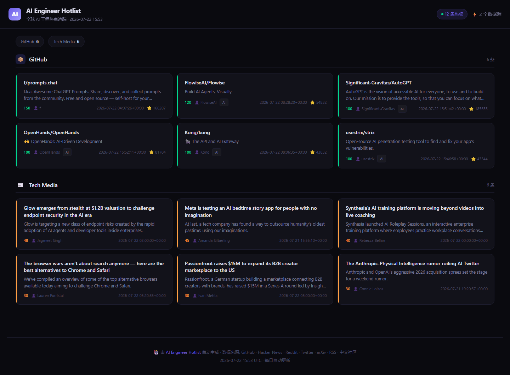
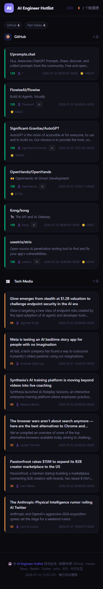
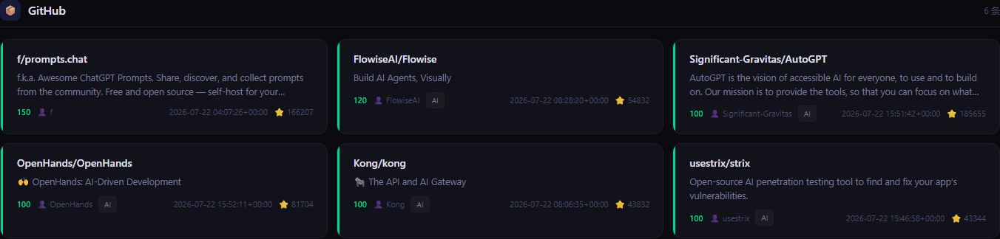
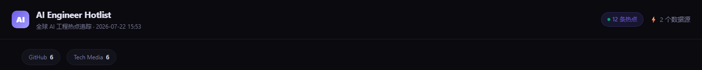

# AI Engineer Hotlist 🔥

> **全球 AI Engineer 热点追踪 · Global AI Engineering Hotspot Tracker**
>
> 每日自动采集 7 大来源的 AI 工程热点 → 生成高品位可视化页面 → 推送企业微信
>
> Daily auto-collect from 7 sources → Beautiful dashboard → WeChat push

---

## Screenshots · 界面预览

| Desktop · 桌面端 | Mobile · 移动端 |
|:---:|:---:|
|  |  |
|  |  |

---

## Data Sources · 数据源

| Source · 来源 | Method · 方式 | Tech · 技术 |
|:---|:---|:---|
| **GitHub Trending** | GitHub Search API (topic:ai/llm/rag/agent) | PyGithub |
| **Hacker News** | Algolia Search API → keyword filter | requests |
| **Reddit** | Public JSON API (no auth needed) | requests |
| **Twitter / X** | nitter.net scraping (API-free) | requests + regex |
| **arXiv** | HTTP API + feedparser | feedparser |
| **Tech Media** | RSS (TechCrunch / The Verge / MIT TR) | feedparser |
| **Chinese Community · 中文社区** | RSS (36kr / Huxiu / Zhihu) | feedparser |

---

## Architecture · 架构

```
ai-engineer-hotlist/
├── .github/workflows/refresh.yml   # GitHub Actions: auto-refresh 2x daily
├── src/
│   ├── main.py                     # Orchestrator · 主编排器
│   ├── models.py                   # Data model + config loader
│   ├── filters.py                  # Hot score engine + dedup + 24h freshness
│   ├── html_generator.py           # Jinja2 → index.html
│   ├── notifiers.py                # WeCom bot push (bypass proxy)
│   ├── collectors/                 # 7 data source collectors
│   │   ├── github.py
│   │   ├── hackernews.py
│   │   ├── reddit.py
│   │   ├── twitter.py
│   │   ├── arxiv.py
│   │   ├── media_rss.py
│   │   └── cn_social.py
│   └── templates/index.html.j2    # Dark theme UI template
├── docs/                           # Output → GitHub Pages
│   ├── index.html
│   ├── data.json
│   └── screenshots/
├── config.yaml                     # Full configuration · 全量配置
├── requirements.txt
└── README.md
```

---

## Quick Start · 快速开始

### Local · 本地运行

```bash
pip install -r requirements.txt

# Run all sources · 全量运行
python -m src.main

# Specific sources · 指定数据源
python -m src.main --sources github,hn,arxiv

# Dry run (no WeChat push) · 试运行（不推送）
python -m src.main --dry-run
```

### GitHub Actions (Recommended · 推荐)

1. **Fork or push** this repo to GitHub
2. **Set Secrets** in repo Settings → Secrets and variables → Actions:

   | Name · 名称 | Value · 值 |
   |:---|:---|
   | `WECOM_WEBHOOK_KEY` | 企业微信机器人 key |
   | `GH_PAT` | GitHub PAT (public_repo read) |

3. **Enable GitHub Pages**: Settings → Pages → Branch `gh-pages` / `docs`
4. **Done!** Auto-refreshes daily at **UTC 1:00 & 13:00** (Beijing 9:00 / 21:00)

---

## Features · 功能特性

| Feature · 特性 | Description · 描述 |
|:---|:---|
| 🎯 **24h Freshness** · 24小时时效 | Only content from the past 24 hours · 只保留24小时内内容 |
| 🔥 **Smart Scoring** · 智能评分 | Base score + keyword boost + time decay |
| 🚫 **Dedup Engine** · 去重引擎 | URL + title similarity dedup within 48h |
| 🌙 **Dark Theme UI** · 暗色主题 | High-quality responsive dark-mode dashboard |
| 📱 **Mobile Friendly** · 移动适配 | Responsive grid, mobile-optimized |
| 🤖 **WeChat Push** · 微信推送 | Enterprise WeChat bot (top 10 daily) |
| ⚡ **Serverless** · 零服务器 | GitHub Actions, no VPS needed |

---

## Configuration · 配置说明

Edit `config.yaml` to customize:

- **Sources**: enable/disable, keywords, limits, score thresholds
- **Filter**: boost rules, dedup window, max items
- **WeCom**: webhook URL (or use env var `WECOM_WEBHOOK_KEY`)
- **Output**: HTML/JSON paths

### Environment Variables · 环境变量

| Variable · 变量 | Purpose · 用途 |
|:---|:---|
| `WECOM_WEBHOOK_KEY` | 企业微信机器人 key (overrides config) |
| `GH_PAT` | GitHub PAT (for API rate limit) |

---

## Custom Collector · 自定义数据源

1. Create `src/collectors/xxx.py`
2. Implement `def collect(cfg: dict) -> list[HotItem]`
3. Register in `src/main.py` `COLLECTORS` dict

```python
# Example · 示例
def collect(cfg):
    return [HotItem(
        title="Example",
        url="https://example.com",
        source="example",
        source_label="Example",
        score=50,
    )]
```

---

## License · 许可

MIT
